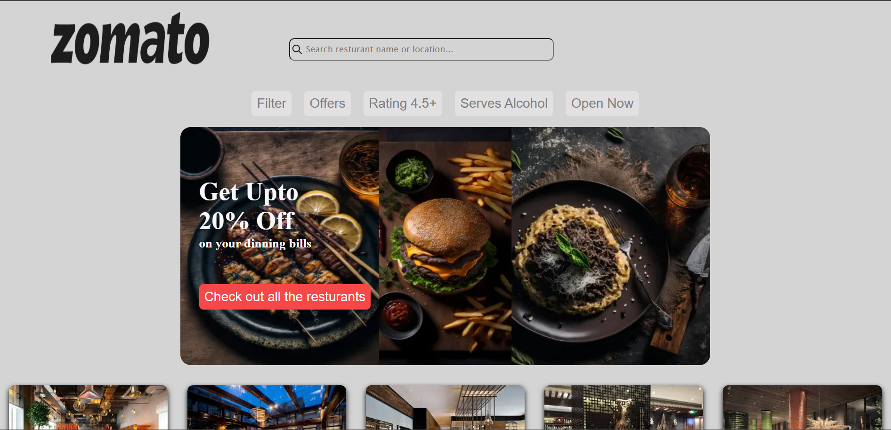
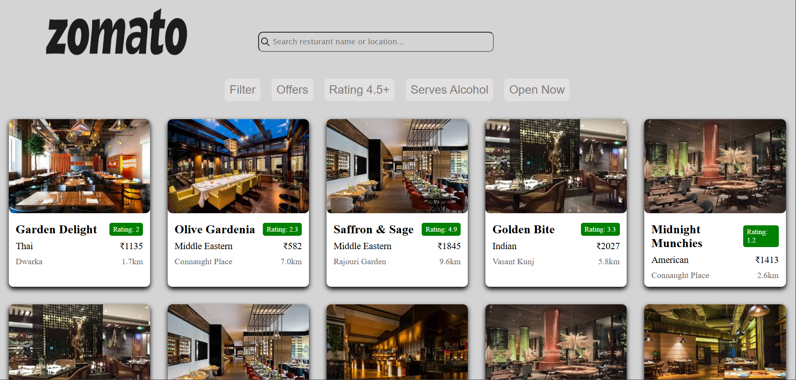

# 🍽️ Zomato Clone

A **responsive Zomato-inspired web app** that displays restaurants with filters, search and dynamic cards.
Built with **HTML, CSS, and JavaScript**.  

---

## ⭐ Features

- 🔍 **Search Bar**: Find restaurants by name or location  
- 🏆 **Filter Options**: Sort by Rating, Price (High ↔ Low) and Distance  
- 🍛 **Restaurant Cards**:
  - Name, Rating
  - Food Type, Price  
  - Location, Distance
  - Offers, Alcohol availability  
  - Opening & Closing Hours  
- 📱 **Responsive Design**: Works on desktop and mobile  
- 🎉 **Promotional Banner** with current offers  

---

## 🎨 Screenshot

 
*Dynamic restaurant cards and banner on homepage.*

---

## 💻 Tech Used

- **HTML5** - Structure and Layout
- **CSS3** - Styling, Flexbox, Media Query
- **JavaScript** - DOM Manipulation, Randomized Data Generation

## ⚒️ How It Works

- **second.js** - To generate random restaurants data (100 restaurants)
- **first.js** - For DOM Manipulation
- Users can **filter, sort, and search** restaurants
- Fully **responsive** using media queries for mobile devices.
